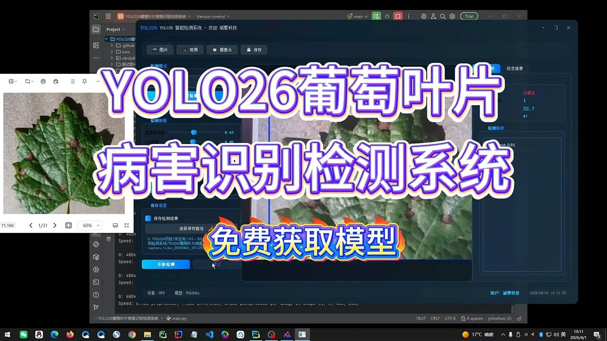
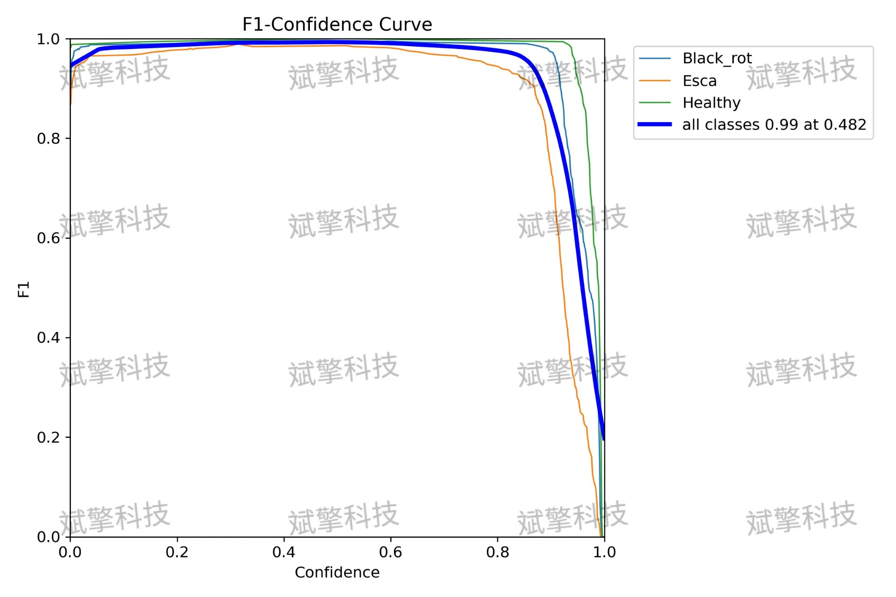
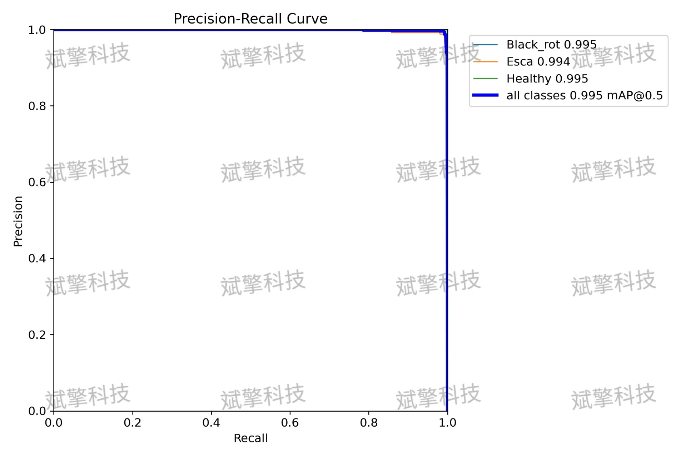
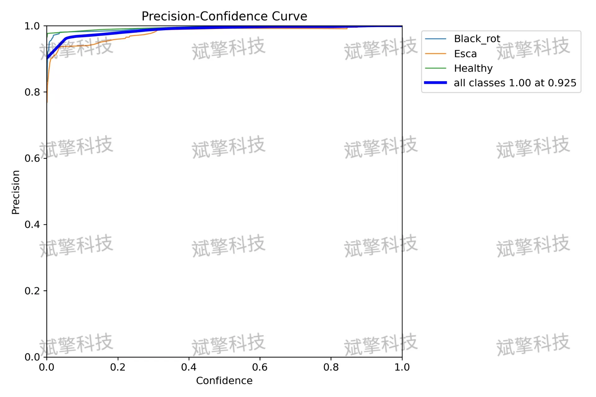
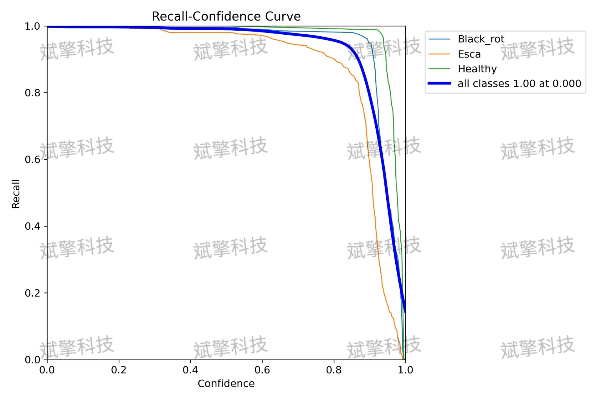
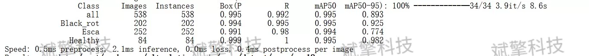
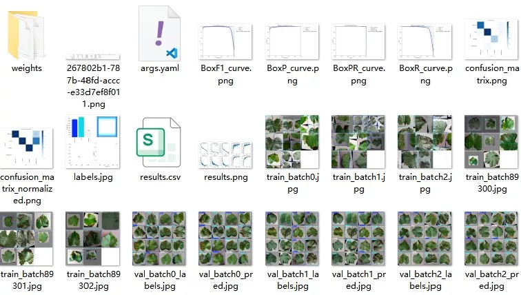
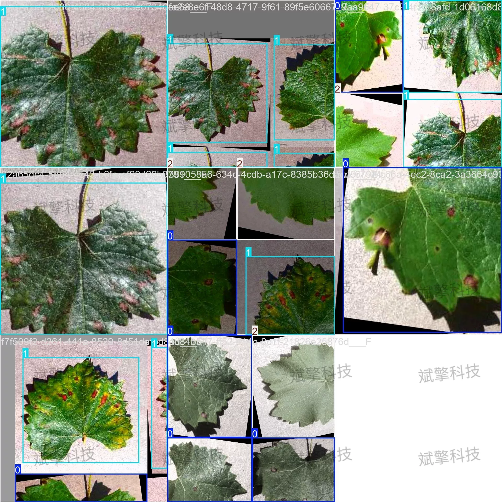
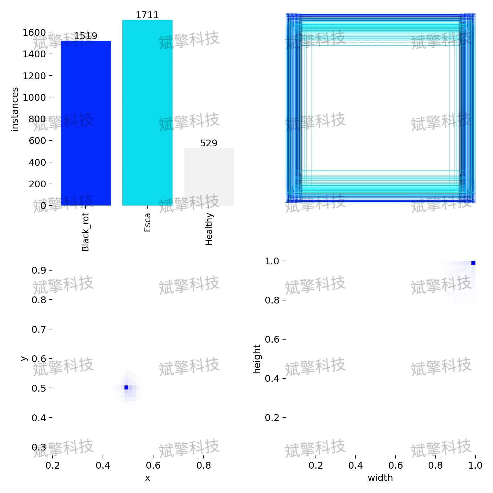

# YOLO26 Grape Disease Leaf Detection System | Source Code

## Body

YOLO26 Grape Disease Leaf Spot Detection System | Source Code: YOLO26 is killing it! Grape leaf disease identification (Black Rot, Esca, Healthy), with a precision rate of over 99%+

Grapes, as an important economic fruit widely cultivated worldwide, are highly vulnerable to various diseases. Traditional disease diagnosis relies on manual field inspection, which has low efficiency, strong subjectivity, and is difficult to detect diseases at the early stages. To address this, this paper proposes a grape leaf disease intelligent recognition system based on the deep learning YOLO26 (You Only Look Once) object detection algorithm. This study constructs a high-quality grape leaf image dataset containing three categories: Black Rot (Black_rot), Esca (Esca), and Healthy (Healthy). The training set consists of 3758 images, the validation set of 538 images, and the testing set of 1074 images. Experimental results show that the model performs excellently on the testing set, achieving a mAP50 of 0.995 and a mAP50-95 of 0.893. Specifically for each category, the precision and recall rates for Black Rot and Esca are close to 0.995, while the recognition accuracy for Healthy leaves reaches 0.991, with a recall rate of 0.98. This system can quickly and accurately identify grape leaf diseases, providing strong technical support for early warning and precise prevention in smart agriculture.

The dataset constructed in this study is specifically used for training and evaluating grape leaf disease detection models, covering three key states: Black Rot, Esca, and Healthy leaves. To ensure the generalization ability of the model, the dataset is rigorously divided:
Training Set (Training Set): Containing 3758 images, used for parameter learning and feature extraction of the model.
Validation Set (Validation Set): Containing 538 images, used during training to adjust hyperparameters, monitor model performance, and prevent overfitting.
Testing Set (Testing Set): Containing 1074 images, used for final evaluation of the model's generalization capability and real performance.
The dataset contains three categories, specifically defined as follows:
Black Rot (Black_rot): Marks the spots of black rot disease on the leaves.
Esca (Esca): Marks the symptoms of Esca disease on the leaves.
Healthy (Healthy): Marks the normal leaf area without any disease symptoms.

Free reservation for remote installation. Unsuccessful refund.
Purchase Enjoy the following resources (Unlocked by Baidu Cloud):
YOLO Identification Detection Project Complete Source Code
YOLO format datasets
Training code + UI interface code
Trained model + result images
Software installer
Add WeChat for remote installation (Automatically displayed after purchase) - Unsuccessful refund

⚙️ Core Function Modules
Detection Capability
Image detection: Upon upload, returns detection boxes + category information
Video detection: Supports video files, analyzes frames precisely
Camera real-time detection: Connects USB camera, achieves dynamic monitoring
Interaction and Control
Target filtering: Choose one or more categories for detection
Parameter real-time adjustment: Adjustable confidence threshold & IoU threshold, flexible control of accuracy
Result saving: Save images/videos/camera detection results in one click
System and Data
User login registration: Supports password strength detection + encryption storage
Log recording: Auto records operation and error information (timestamped)

## Images

## Payment

Here is a pay link on Stripe ( https://buy.stripe.com/3cs8yP7sY87d0vu9AB ). Please contact me lonlonago@foxmail.com after funding $89, and I will send you a complete data files , thank you!

